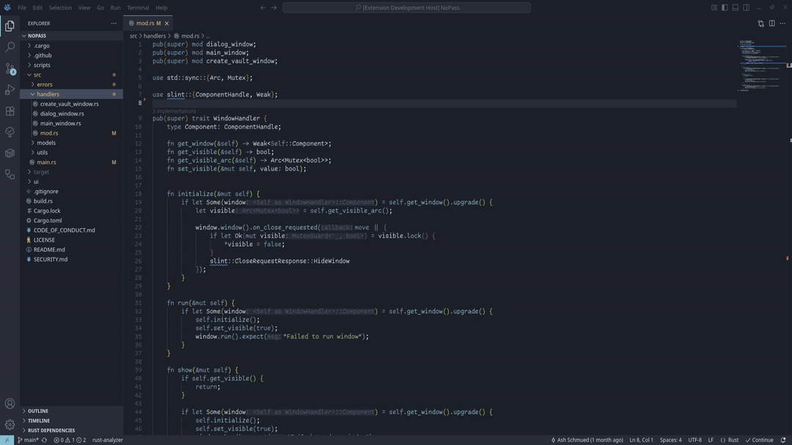

# rust-mod-creator

This extension makes it easy to create and update Rust modules and submodules.

1. In the file explorer, right-click in the directory you want to create your new module or submodule.
2. Click "Create New Module".
3. Enter the name of your new Module.
   - Adding a trailing `.` or `.rs` will create a new submodule file.
   - Adding a trailing `/` or no trailing symbol will create a new module directory with a new inner `mod.rs` file.
4. Select the access modifier for your new Module.
5. New module is now created and added to the top of existing `mod.rs`.
    - If there is no existing `mod.rs` file, it will try to add mod line to `lib.rs` then will try `main.rs`.
      - If it still cannot find a file, it will create a new `mod.rs` and append to that.

## Features

### Simple context-menu shortcut to create a new module or submodule

## Create modules using commands

## Requirements

- VSCode ^1.50.0

## Extension Settings

This extension contributes the following settings:

* `rustModCreator.autoFocus`: Automatically focus the newly created module file in the editor.
* `rustModCreator.showSuccessMessage`: Shows message that a new module was created.

## Known Issues

- Module lines get added before attribute blocks (`#[]` and `#![]`), causing errors until repositioned manually.

## Release Notes

### 0.0.3

- Adds config option to disable message on successful module creation.
- Adds config option to change visibility options when creating a module.
- Fixes issue when creating a module from command where it would not actually create the module.
- Fixes `rustModCreator.AutoFocus` to work properly.
- Changes to automatically create `mod.rs` file if `main.rs`, `lib.rs` or existing `mod.rs` file is not found.

### 0.0.2

Added example images to README.md

### 0.0.1

Initial release of Rust Mod Creator
